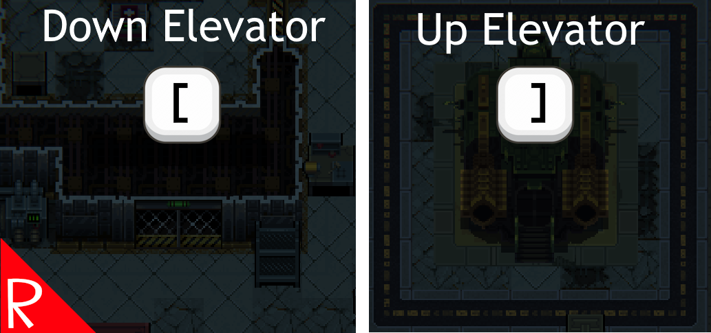

# Quasimorph Camera To Exits

Adds a hotkey to move the camera view to the current level's exits.  Helpful when the player is moving loot back to the shuttle from multiple floors.

Press left bracket for move to the down elevator.  Press right bracked to move to the up elevator or shuttle.

The camera will only move if the target has already been explored.

The hotkeys can be configured.

# Configuration

The configuration file will be created on the first game run and can be found at `%AppData%\..\LocalLow\Magnum Scriptum Ltd\Quasimorph_ModConfigs\CameraToExits\config.json`.

|Name|Default|Description|
|--|--|--|
|MoveToDownElevatorKey|Left Bracket|When pressed, moves to the elevator that goes down.|
|MoveToUpElevatorKey|Right Bracket|When pressed, moves to the elevator that goes up or the shuttle.|

## Key List
The list of valid keyboard keys can be found  at the bottom of https://docs.unity3d.com/ScriptReference/KeyCode.html
Beware that numbers 0-9 are Alpha0 - Alpha9.  Most of the other keys are as expected such as X for X.
Use "None" to not bind the key.

# Buy Me a Coffee
If you enjoy my mods and want to buy me a coffee, check out my [Ko-Fi](https://ko-fi.com/nbkredspy71915) page.
Thanks!

# Source Code
Source code is available on GitHub at https://github.com/NBKRedSpy/QM_CameraToExits
